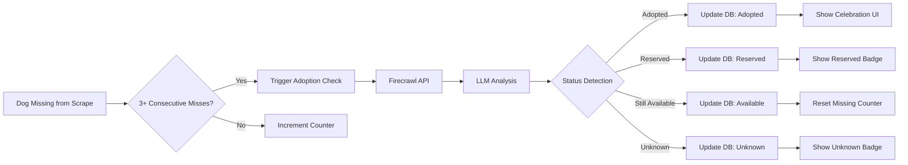

# Adoption Detection Feature

## Overview

The Adoption Detection feature is an intelligent system that tracks the outcome of rescue dogs after they disappear from organization websites. It preserves SEO value by keeping all dogs in the sitemap while accurately determining whether they were adopted, reserved, or remain available through another channel.

**Key Benefits:**
- 🔍 **Intelligent Status Detection**: Uses AI to analyze shelter pages and determine dog outcomes
- 📈 **SEO Preservation**: All dogs remain in sitemap regardless of status
- 🎉 **Adoption Celebrations**: Special UI for successfully adopted dogs
- 📊 **Outcome Tracking**: Analytics on adoption success rates

## Architecture

### System Flow



### Components

#### 1. **AdoptionDetectionService** (`services/adoption_detection.py`)
Core service that interfaces with Firecrawl API to analyze dog pages and determine adoption status.

**Key Features:**
- Multi-language support (English, German, Spanish)
- Confidence scoring for detection accuracy
- Evidence extraction and storage
- Batch processing capabilities
- 24-hour recheck prevention

#### 2. **Database Schema**
Migration 013 extends the animals table:
- `adoption_check_data` (JSONB): Stores detection evidence and metadata
- `adoption_checked_at` (TIMESTAMP): Last check timestamp
- Status enum extended: `adopted`, `reserved`, `unknown` (replacing `unavailable`)

**Indexes for Performance:**
```sql
-- Efficient querying for dogs needing checks
CREATE INDEX idx_animals_adoption_check
ON animals(organization_id, consecutive_scrapes_missing, status)
WHERE status NOT IN ('adopted', 'reserved');

-- Track recent checks
CREATE INDEX idx_animals_adoption_checked_at
ON animals(adoption_checked_at)
WHERE adoption_checked_at IS NOT NULL;
```

#### 3. **Management Command** (`management/check_adoptions.py`)
CLI tool for running adoption checks:
```bash
# Check single organization
python management/check_adoptions.py --org dogstrust

# Check all configured organizations
python management/check_adoptions.py --all

# Preview without making changes
python management/check_adoptions.py --all --dry-run
```

#### 4. **API Endpoints**

**Sitemap Endpoint** (`api/routes/sitemap.py`)
- Returns ALL dogs regardless of status
- Different update frequencies based on status
- Preserves SEO value for adopted dogs

**Animal Service Updates** (`api/services/animal_service.py`)
- Includes adoption check data in responses
- No filtering by status - adopted dogs remain accessible
- Enhanced metadata for tracking

#### 5. **Frontend Components**

**AdoptedCelebration** (`frontend/src/components/dogs/AdoptedCelebration.jsx`)
- Purple gradient celebration banner
- Emotional messaging about finding forever home
- Explains why page remains active

**DogStatusBadge** (`frontend/src/components/dogs/DogStatusBadge.jsx`)
- Visual indicators for each status:
  - ✅ Available: Green badge
  - 🎉 Adopted: Purple celebration badge
  - 🔒 Reserved: Blue pending badge
  - ❓ Unknown: Yellow checking badge

## Configuration

### Organization Configuration
Add to organization YAML files:

```yaml
# configs/organizations/dogstrust.yaml
organization:
  name: Dogs Trust
  check_adoption_status: true  # Enable feature
  adoption_check_threshold: 3  # Scrapes before checking
  adoption_check_config:
    max_checks_per_run: 50    # API rate limiting
    check_interval_hours: 24  # Minimum between rechecks
```

### Environment Variables
```bash
# Required for Firecrawl API
FIRECRAWL_API_KEY=your_api_key_here

# Optional configuration
ADOPTION_CHECK_ENABLED=true
ADOPTION_CHECK_BATCH_SIZE=50
```

## Implementation Details

### Status Detection Logic

The service uses Firecrawl's LLM extraction to analyze dog pages:

```python
prompt = """
Analyze this rescue dog page and determine status:
- Look for: "Adopted", "Rehomed", "Found home" → 'adopted'
- Look for: "Reserved", "On hold", "Pending" → 'reserved'
- Look for: "Available", "Looking for home" → 'available'
- If unclear or error → 'unknown'

Also check in German: "Vermittelt", "Adoptiert"
And Spanish: "Adoptado", "Reservado"

Return: status, evidence (text found), confidence (0-1)
"""
```

### Performance Optimizations

1. **Batch Processing**: Process up to 50 dogs per run
2. **24-Hour Cache**: Prevent redundant checks within a day
3. **Smart Indexing**: Database indexes for efficient queries
4. **Async Operations**: Non-blocking API calls to Firecrawl

### Error Handling

- **Missing API Key**: Service gracefully disables if no key configured
- **Rate Limiting**: Exponential backoff for API limits
- **Page Not Found**: Mark as unknown, retry later
- **Network Errors**: Log and skip, continue with next dog

## Testing

### Test Coverage

```bash
# Unit tests for service
pytest tests/services/test_adoption_detection.py

# API endpoint tests
pytest tests/api/test_adoption_status_endpoints.py

# Management command tests
pytest tests/management/test_check_adoptions.py

# Integration tests
pytest tests/scrapers/test_adoption_integration.py
```

### Test Scenarios
- ✅ Successful adoption detection
- ✅ Reserved status detection
- ✅ Still available detection
- ✅ Unknown/error handling
- ✅ API key missing
- ✅ Rate limiting
- ✅ Multi-language detection
- ✅ Evidence truncation
- ✅ Confidence scoring

## Metrics & Monitoring

### Key Metrics
- **Detection Accuracy**: Track manual validations vs automated detection
- **API Usage**: Monitor Firecrawl API calls and costs
- **SEO Impact**: Track sitemap inclusion and search rankings
- **User Engagement**: Monitor adopted dog page visits

### Sentry Integration
The service includes Sentry monitoring for:
- API failures and error rates
- Performance tracking
- Detection accuracy trends

## User Experience

### For Visitors
- **Celebration Pages**: Adopted dogs show special celebration UI
- **Clear Status**: Visual badges indicate current status
- **SEO Friendly**: All dogs remain findable via search

### For Organizations
- **Automated Tracking**: No manual status updates needed
- **Accuracy**: AI-powered detection reduces errors
- **Analytics**: Track adoption success rates

## Migration Guide

### From Previous System

1. **Database Migration**:
```bash
# Run migration to add new columns and indexes
python management/run_adoption_migration.py
```

2. **Status Conversion**:
- All `unavailable` → `unknown`
- Triggers adoption checks on next run

3. **Configuration Update**:
- Add adoption settings to organization YAMLs
- Set environment variables

4. **Initial Run**:
```bash
# Check all unknown status dogs
python management/check_adoptions.py --all
```

## Troubleshooting

### Common Issues

**1. No adoption checks running**
- Verify `FIRECRAWL_API_KEY` is set
- Check organization config has `check_adoption_status: true`
- Ensure dogs have `consecutive_scrapes_missing >= 3`

**2. Incorrect status detection**
- Review evidence in `adoption_check_data`
- Adjust language-specific keywords if needed
- Consider organization-specific patterns

**3. Performance issues**
- Reduce `max_checks_per_run` in config
- Increase `check_interval_hours`
- Monitor Firecrawl API usage

## Future Enhancements

### Planned Features
- 📅 Adoption timeline tracking
- 📧 Automated celebration emails
- 📊 Organization-specific success metrics
- 🌍 Additional language support
- 🔄 Webhook notifications for status changes

### API Extensions
- GraphQL support for adoption data
- Bulk status update endpoint
- Historical adoption analytics API

## Related Documentation

- [Scraper System](../scrapers/README.md)
- [API Documentation](../api/README.md)
- [Database Schema](../database/README.md)
- [Frontend Components](../frontend/README.md)

## Support

For issues or questions about the adoption detection feature:
1. Check the [troubleshooting guide](#troubleshooting)
2. Review test files for usage examples
3. Check Sentry for error details
4. Open an issue on GitHub with logs and configuration
